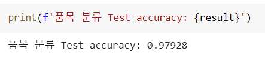
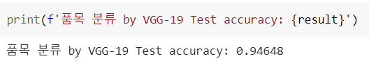
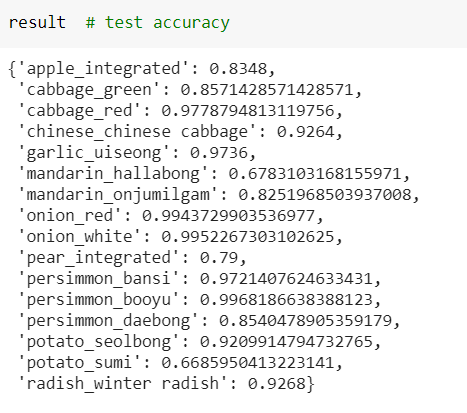

# AI-Data-Hackathon-Competiton
Agricultural Video AI Data Utilization Idea Hackathon


2021 AI Hackathon Competition 최우수상


## Topic

This AI competition held at NIA 

The Topic is classifying variety and quality of fruits through image analysis  
Deep learning analysis has made several efforts to proceed more efficiently as it is a topic that is not easy and due to its large capacity.
In addition, the advantages and disadvantages of deep learning are compared by analyzing machine learning.


## ML

### Environment

- Colab(cause it provides GPU)
- Google Drive(ZIP file)

### Installation

```
$ pip install -U scikit-learn
```

Clone Repository...

```
$ mkdir project
$ cd project
$ git clone https://github.com/DongChanKIM2/AI-Data-Hackathon-Competiton.git
$ cd AI-Data-Hackathon-Competiton
```

### Results

confirm the zip extracted


## DL

### Environment

- Colab(cause it provides GPU)
- Google Drive(ZIP file)

### Installation

```
$ pip install tensorflow
```

clone Repository

```
$ mkdir project
$ cd project
$ git clone https://github.com/DongChanKIM2/AI-Data-Hackathon-Competiton.git
$ cd AI-Data-Hackathon-Competiton
```

### Results








## Feedback

This is the first time to challenge a AI Competition 

During this project, I've learned that there are so many techniques of analysis and ways of optimization

I should keep study steadily...

Thanks to 형규 and 은상


## License

----
Copyright © 2021 [Chan](https://github.com/DongChanKIM2)
APACHE

